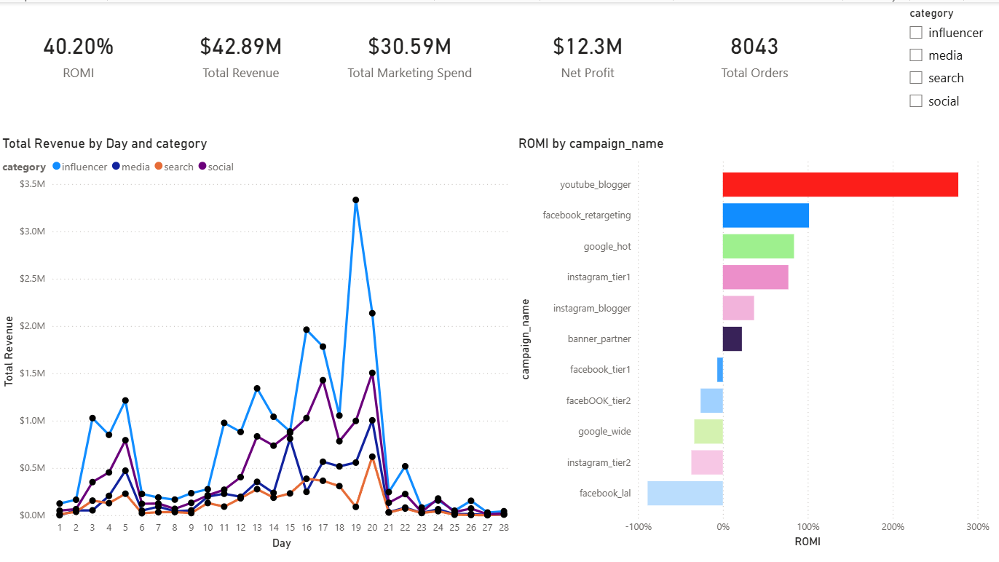
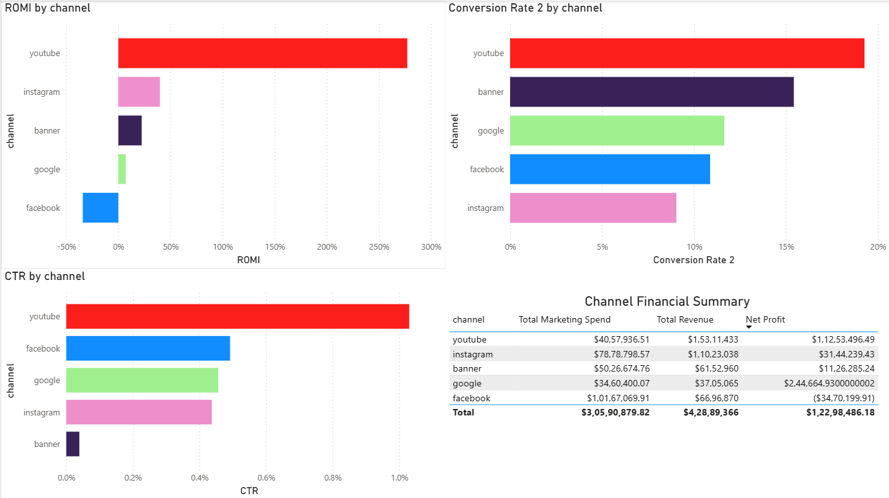
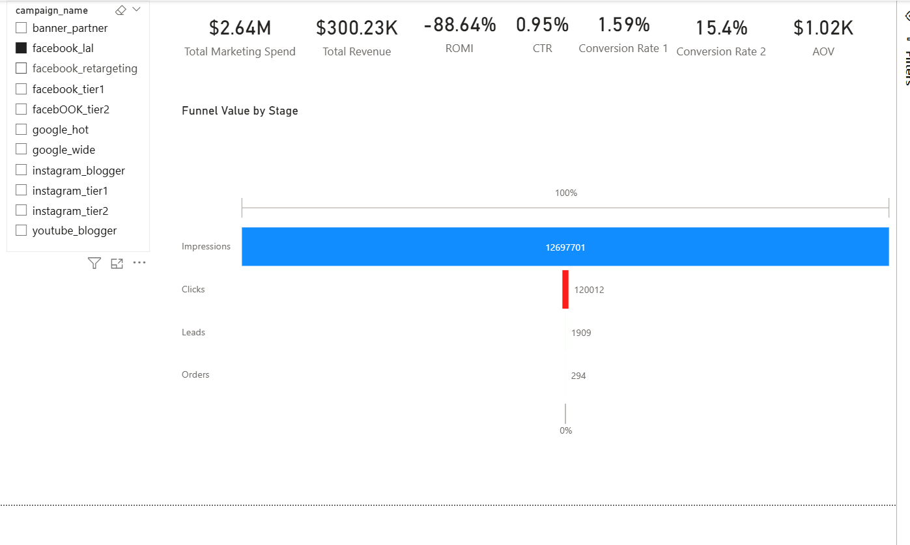

# Marketing Campaign Performance Analysis Dashboard

## Project Overview

This project presents an interactive Power BI dashboard designed to analyze the performance of marketing campaigns. It provides a comprehensive view of key business metrics, including Return on Marketing Investment (ROMI), revenue, marketing spend, net profit, and total orders.

The dashboard enables Marketing Managers to evaluate campaign effectiveness, compare marketing performance, identify underperforming campaigns, and make data-driven decisions to optimize marketing investments and maximize business returns.

---

## Project Objectives

* Analyze campaign performance across multiple marketing channels.
* Evaluate Return on Marketing Investment (ROMI) and campaign profitability.
* Identify high-performing and underperforming campaigns.
* Analyze customer conversion through the marketing funnel.
* Enable data-driven marketing investment decisions.

---

## Business Problem

Marketing teams invest significant budgets across multiple campaigns and channels, but identifying which campaigns generate the highest returns and where performance losses occur can be challenging.

This dashboard consolidates campaign performance metrics into a single interactive report, enabling Marketing Managers to monitor campaign effectiveness, evaluate marketing ROI, identify funnel drop-offs, and make informed decisions on budget allocation and campaign optimization.

---

## Business Questions

This dashboard helps answer the following business questions:

* Which marketing campaigns generated the highest revenue?
* Which campaigns delivered the highest and lowest ROMI?
* Which campaigns are underperforming in terms of revenue and profitability?
* At which stage of the marketing funnel are potential customer drop-offs occurring?
* Which marketing channels deliver the best conversion and return on investment?
* Which campaigns should be scaled, optimized, or discontinued based on performance?

---

## Dashboard Overview

### 1. Executive Summary

Provides a high-level overview of marketing campaign performance through key business metrics and trend analysis.

**Key Metrics**

* Return on Marketing Investment (ROMI)
* Total Revenue
* Total Marketing Spend
* Net Profit
* Total Orders

**Key Visualizations**

* KPI Cards
* Line Chart
* Bar Chart

**Business Value**

Enables Marketing Managers to evaluate overall campaign performance, compare campaign performance across categories, and identify opportunities to optimize marketing spend and improve business outcomes.

#### Dashboard Preview

---

### 2. Channel Performance

Compares the performance of marketing channels to evaluate their effectiveness in driving business results.

**Key Metrics**

* Return on Marketing Investment (ROMI)
* Click-Through Rate (CTR)
* Lead-to-Order Conversion Ratio
* Marketing Spend
* Total Revenue
* Net Profit

**Key Visualizations**

* Three Bar Charts comparing:

  * Return on Marketing Investment (ROMI)
  * Click-Through Rate (CTR)
  * Lead-to-Order Conversion Ratio
* Performance Summary Table displaying:

  * Marketing Spend
  * Total Revenue
  * Net Profit

**Business Value**

Enables Marketing Managers to compare the effectiveness of different marketing channels by evaluating profitability, customer engagement, and conversion performance. It supports data-driven decisions on budget allocation, channel optimization, and future marketing investments.

#### Dashboard Preview

---

### 3. Campaign Deep Dive

Provides a detailed analysis of individual marketing campaigns by examining campaign-specific performance metrics and conversion funnel stages.

**Key Insights**

* Campaign performance comparison
* Marketing funnel analysis
* Conversion stage performance
* Campaign-level KPI evaluation

**Key Visualizations**

* Split Chart with campaign KPIs
* Funnel Chart illustrating campaign conversion stages

**Business Value**

Enables Marketing Managers to evaluate individual campaign performance, identify conversion bottlenecks, and understand how funnel drop-offs impact revenue and Return on Marketing Investment (ROMI). It supports targeted optimization of campaigns to improve conversion rates and maximize marketing returns.

#### Dashboard Preview

---

## Key Business Insights

Based on the analysis of the marketing campaign data, the following business insights were identified:

* **YouTube** emerged as the highest-performing marketing channel, delivering the strongest Return on Marketing Investment (ROMI).
* The **YouTube Blogger** campaign generated the best overall performance, making it a strong candidate for future marketing investment.
* Funnel analysis revealed noticeable customer drop-offs during the conversion journey, highlighting opportunities to improve conversion rates and increase revenue.
* **YouTube** consistently demonstrated the highest Click-Through Rate (CTR), indicating strong customer engagement.
* Although **Facebook** achieved a competitive CTR, it resulted in a negative ROMI, indicating that high engagement alone did not translate into profitable conversions. This suggests a need to review campaign targeting, conversion strategy, or marketing spend.

---

## Tools & Technologies

* **Power BI** – Interactive dashboard development and data visualization
* **Power Query** – Data cleaning and transformation
* **DAX (Data Analysis Expressions)** – Business measures and calculated columns
* **CSV** – Source dataset
* **Git & GitHub** – Version control and project hosting

---

## Dataset

## Dataset

- **Dataset:** Marketing Campaign Dataset
- **Source:** https://www.kaggle.com/datasets/manishabhatt22/marketing-campaign-performance-dataset/data
- **Format:** CSV

---

## Implementation Highlights

* Developed a three-page interactive Power BI dashboard to analyze marketing campaign performance.
* Built a data model by creating and relating supporting tables to enable accurate analysis across multiple dimensions.
* Used Power Query to clean and transform the source data for reporting.
* Developed DAX measures to calculate key business KPIs, including ROMI, Total Revenue, Marketing Spend, Net Profit, and Total Orders.
* Designed an interactive marketing funnel to visualize campaign conversion stages and identify customer drop-off points.
* Built interactive visualizations with cross-filtering and slicers to enable detailed campaign and channel analysis.
* Designed intuitive dashboard navigation and interactive filtering to improve report usability and support business decision-making.
